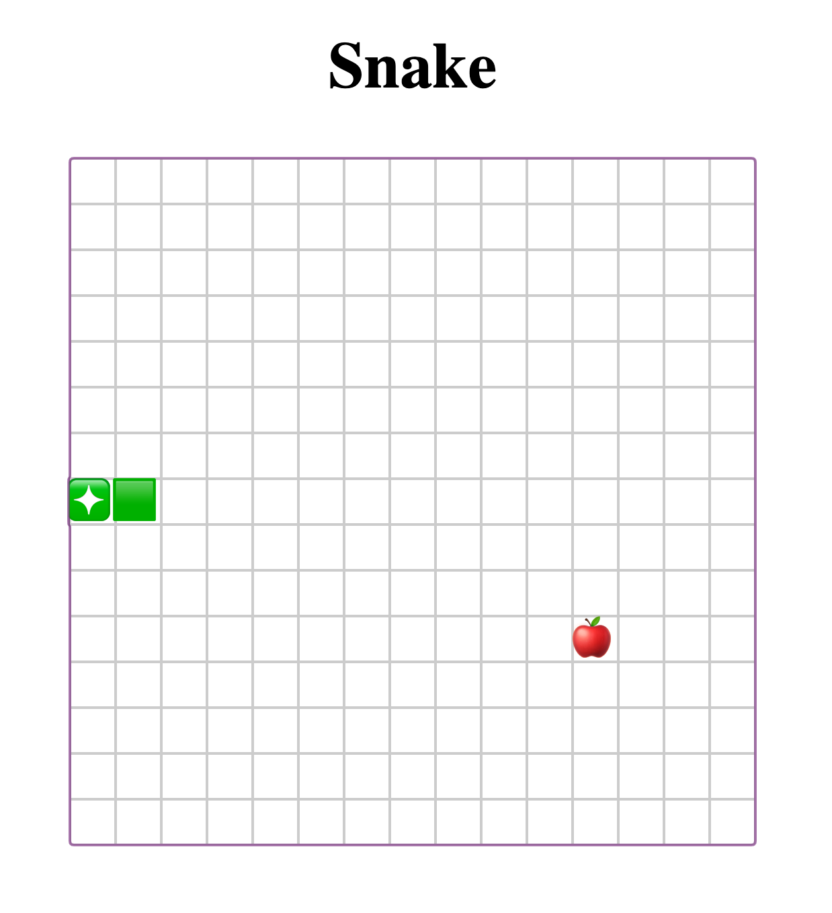

# Snake Game

 

## Technology

This project has been built using the [Rust](https://www.rust-lang.org) programming language and [Yew](https://yew.rs/) framework.

## Building

Make sure you have [Rust](https://www.rust-lang.org) installed.

You will need Web Assembly target:

```bash
$ rustup target add wasm32-unknown-unknown
```

Install [Trunk](https://github.com/thedodd/trunk) to serve the project in local:

```bash
$ cargo install trunk
```

## Run it

To run it in local you need to run the trunk serve command

```bash
$ trunk serve
```

## Live demo

[Snake Live Demo](https://aesthetic-froyo-c78a5b.netlify.app/)